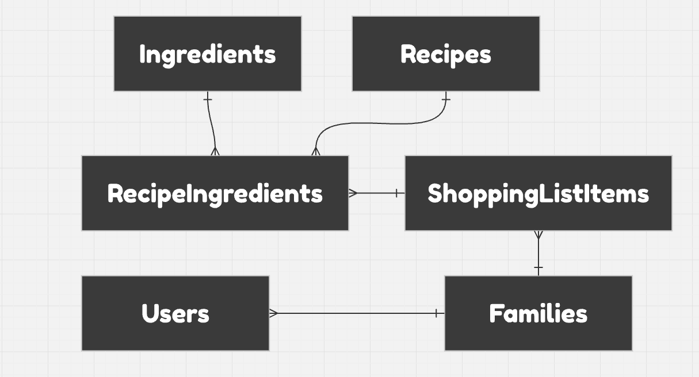

## [Overview](https://drive.google.com/file/d/1UpjrIJQ4gIcPB6IvEkNNxIwILXevkIaK/view?usp=drive_link) 

In this step we will add streaming capabilities from the NLAPI as well as more functionality to the app by adding recipes, ingredients and a family shopping list.

## Steps:

**1. Run `npm run seed`** to update the database with new data needed for this stage.

**2. Run `npm run update-schema`** to make sure your application has the most updated schema (this will be updated automatically every time you push to one of the branches in the `.github/workflows/update-schema.yml` file)

**3. Test out streamming UI**: Login at http://localhost:5573, ask 'What recipes are available?', and watch the reply.

**4. Try adding a new recipe**: Use the chat to add a new recipe. Go to http://localhost:5573/recipes to see the new recipe.

## Features Added:

- **Streaming Messages**: This allows the message reply look to like it's typing back a response in real time.
- **Added Endpoints**: Gives the api more functionality by adding recipes, ingredients, and shopping list
  If visualizing is helpful, here is an ERD sample of the current database.

  

## Notes:

- Scroll to bottom behavior explanation (Comment out `
` in ChatBubble.jsx and ask the bot a few follow up questions to understand why it's important)
- Displays status messages, you can map responses if needed.
- Note Recipe Ingredient Unique Constraint Error Message.
- Note: Current limitation to the Shopping list is that you can only add ingredients from a recipeIngredient
- Remember to run `npm run update-schema`
- Added UI - Still have to refresh the page when using chat. Will fix this is stage-4

## Functionality Demonstration
[Screencast of Functionality](https://github.com/user-attachments/assets/0fbee2d7-795a-49cf-adbd-7506b0270891)

## Common Errors:

**Bot choosing the right endpoints to call**: It's likely that you forgot to run `npm run update-schema` Or something failed in that process. Run the command and check the output for a success message. If you get a success output. Make sure you are sending the correct file and that it has been updated from running `npm run dev`. If everything is correct and you are still having issues, please reach out to jase@jasekraft.com, and I'll gladly assist you as needed.
